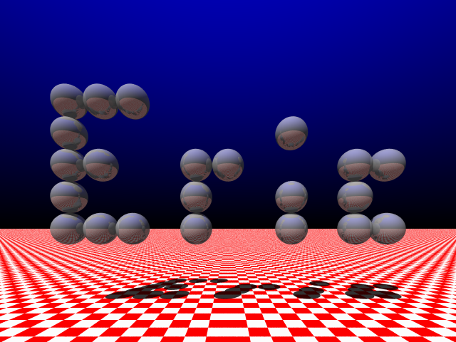

I have used PoV-Ray quite a bit, and knew the theory behind raytracers, but had never written one.
I also had heard of the challenge of making a raytracer that could fit on a business card.

In order from most readable to least readable, each of the following programs performs the same action.
The final version, `short.cc`, uses 1187 characters.

* main.cc
* no_vector.cc
* reducing_constants.cc
* short.cc

The output image is shown below.

